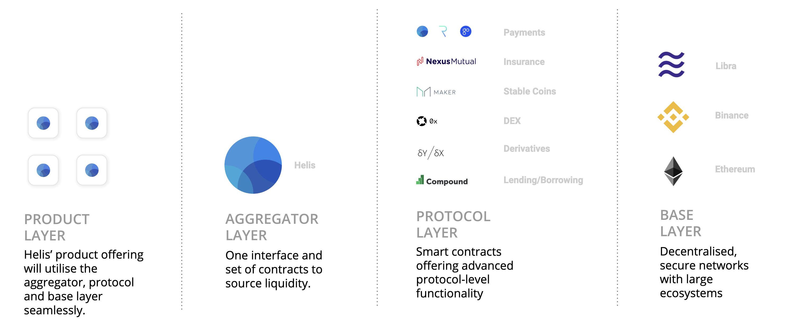
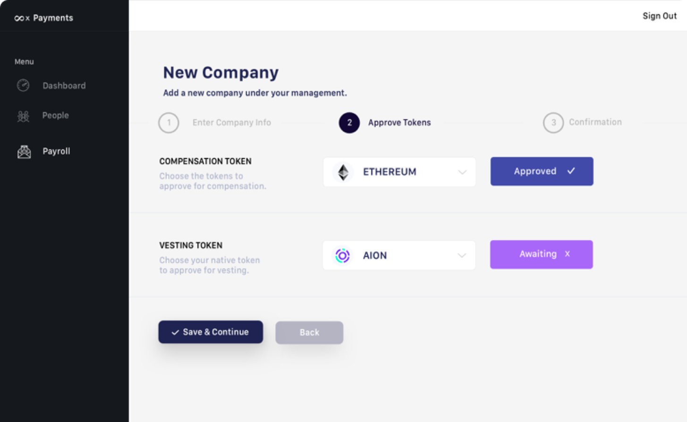

# Product

## Overview

Below is a diagram about how we see the entire Helis stack and its various components.

**Products** exists as a suite of decentralised applications that are extremely easy to use for enterprises. The first flagship product is payroll, followed by loans and derivatives.

**Aggregator** layer provides a single interface and set of smart contracts to source liquidity and the best prices for enterprises to lend.

**Protocol** layer is utilised by the aggregator layer to draw upon a combination of open-source protocols for lending, exchanges, derivatives and more. Helis has also developed their own payments protocol that offers options to make flexible payments with the ability to execute different types of schedules and currencies in them. Built upon a standard framework comprised of Ethereum smart contracts and front-end libraries.

**Base** layer is to tap into various blockchains for their unique strengths. Ethereum is used for its programmability, Binance DEX for liquidity and Facebook’s Libra for mainstream distribution.

## Payroll

Our flagship product is payroll which we started developing late last year after learning about the problem first-hand from customers. Automating processes with paying out employees, freelancers or investors is the main value add as it saves time and introduces operational efficiencies.

View a video demo at: [https://www.youtube.com/watch?v=fxQUoyfw2eM](https://www.youtube.com/watch?v=fxQUoyfw2eM)

**Key features** of the product include:

* Being able to make salary payments in 3 easy steps
* Executing batched payments for bounty payments or contractors
* Distributing vested tokens to employees as part of their compensation agreements
* Automating tax allocations by specifying tax wallet addresses and tax rates per employee
* Getting a high level summary of current wallet balances

## Payment Protocol

Payroll utilises the Helis Payment Protocol contracts which allow custom types of payments through a series of smart contracts. A deeper overview of how this functions can be read from the white paper. 

## Demo

For a live demo or access please contact us at **hello@helis.network** 

## Future Roadmap

For more details about our future product roadmap please refer to the white paper.

