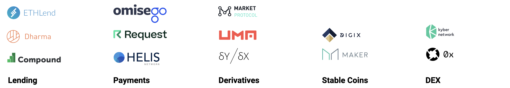
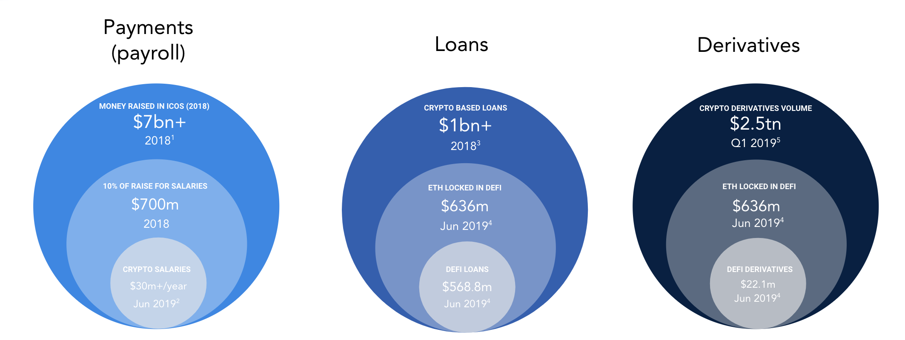

# What is DeFi?

DeFi stands for **decentralised finance**. However,  before we go into decentralised finance, it's important to note how centralised finance works.

## Institutions, Markets, Instruments

In traditional finance, there are three major concepts to understand:

* Institutions. Think governments, banks, hedge funds, financial services, pension funds etc.
* Markets. Think NASDAQ, Craigslist, Uber, Airbnb
* Instruments. Derivatives, loans, equity, debt.

At the core of all of these is currency. 

**Bitcoin/Ethereum** have removed the need for governments and financial institutions. 

**Tokens,** as an asset class, have created new digital, global markets.

**Decentralised finance** has giving access to instruments to anyone with an internet connection!

## Decentralised Finance

When referring to decentralised finance, we broadly think of the following categories:

* **Lending** that can be instantiated by anyone, anywhere
* **Derivatives** where no middle-men are required
* **Payments** that are cross-border from day one
* **Stable** coins to ensure stable value
* **Decentralised** exchanges to swap between assets easily and frictionlessly

All of the above are fully **non-custodial** and can be accessed by anyone, anywhere.

## Why DeFi?

In our view, the DeFi market will continue to expand tremendously over the coming years. Below is an overview of the current state of the market. 

1.  ****[**ICO Raise 2018**](https://www.icodata.io/stats/2018)\*\*\*\*
2.  ****[**Bitwage salary volume**](https://www.coindesk.com/employers-can-now-pay-salaries-in-ether-via-crypto-startup-bitwage) as of 2018
3. [**Custodial loans**](https://www.theblockcrypto.com/2019/01/18/block-by-block-crypto-lending/)\*\*\*\*
4. \*\*\*\*[**https://defipulse.com**](https://defipulse.com) as of Jun 2019
5. \*\*\*\*[**Cryptocurrency derivatives market**](https://help.bybit.com/hc/en-us/articles/360015362354-How-Big-are-Cryptocurrency-Derivative-Markets-)    

